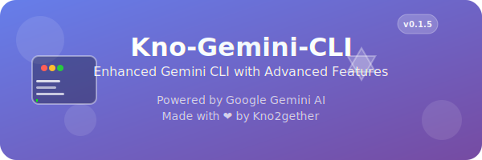

# Kno-Gemini-Cli

This is a fork of the [Gemini CLI](https://github.com/google-gemini/gemini-cli), an open-source tool from Google, licensed under the Apache License 2.0. This version has been modified to support additional features, including the ability to use OAuth credentials for CI/CD workflows.

## Stay Updated

<div align="center">
  <a href="https://youtube.com/@kno2gether">
    
  </a>

  <h3>Subscribe to Our YouTube Channel!</h3>
  
  [](https://youtube.com/@kno2gether)
</div>

Stay up to date with the latest features, tutorials, and tips about Kno-Gemini-CLI by subscribing to our YouTube channel. We're constantly enhancing this tool with exciting new capabilities to make your development experience even better!

---


## Quickstart

1. **Prerequisites:** Ensure you have [Node.js version 18](https://nodejs.org/en/download) or higher installed.
2. **Run the CLI:** Execute the following command in your terminal:

   ```bash
   npx kno-gemini-cli
   ```

   Or install it with:

   ```bash
   npm install -g kno-gemini-cli
   gemini
   ```

3. **Pick a color theme**
4. **Authenticate:** When prompted, sign in with your personal Google account. This will grant you up to 60 model requests per minute and 1,000 model requests per day using Gemini.

You are now ready to use the Kno-Gemini-Cli!

### For advanced use or increased limits:

If you need to use a specific model or require a higher request capacity, you can use an API key:

1. Generate a key from [Google AI Studio](https://aistudio.google.com/apikey).
2. Set it as an environment variable in your terminal. Replace `YOUR_API_KEY` with your generated key.

   ```bash
   export GEMINI_API_KEY="YOUR_API_KEY"
   ```

### OAuth Configuration (Advanced)

For Code Assist features, you can override the default OAuth client credentials using environment variables:

```bash
# Override OAuth Client ID and Secret
export GEMINI_OAUTH_CLIENT_ID="your_oauth_client_id"
export GEMINI_OAUTH_CLIENT_SECRET="your_oauth_client_secret"

# Or provide full OAuth credentials as JSON
export GEMINI_OAUTH_CREDENTIALS_JSON='{"client_id":"...","client_secret":"...","refresh_token":"..."}'
```

**Note:** These environment variables are optional. If not set, the CLI will use the default OAuth credentials for Code Assist authentication.

For other authentication methods, including Google Workspace accounts, see the [authentication](./docs/cli/authentication.md) guide.

## Examples

Once the CLI is running, you can start interacting with Gemini from your shell.

You can start a project from a new directory:

```sh
cd new-project/
gemini
> Write me a Gemini Discord bot that answers questions using a FAQ.md file I will provide
```

Or work with an existing project:

```sh
git clone https://github.com/avijeett007/kno-gemini-cli
cd kno-gemini-cli
gemini
> Give me a summary of all of the changes that went in yesterday
```

### Next steps

- Learn how to [contribute to or build from the source](./CONTRIBUTING.md).
- Explore the available **[CLI Commands](./docs/cli/commands.md)**.
- If you encounter any issues, review the **[Troubleshooting guide](./docs/troubleshooting.md)**.
- For more comprehensive documentation, see the [full documentation](./docs/index.md).
- Take a look at some [popular tasks](#popular-tasks) for more inspiration.

### Troubleshooting

Head over to the [troubleshooting](docs/troubleshooting.md) guide if you're
having issues.

## Popular tasks

### Explore a new codebase

Start by `cd`ing into an existing or newly-cloned repository and running `gemini`.

```text
> Describe the main pieces of this system's architecture.
```

```text
> What security mechanisms are in place?
```

### Work with your existing code

```text
> Implement a first draft for GitHub issue #123.
```

```text
> Help me migrate this codebase to the latest version of Java. Start with a plan.
```

### Automate your workflows

Use MCP servers to integrate your local system tools with your enterprise collaboration suite.

```text
> Make me a slide deck showing the git history from the last 7 days, grouped by feature and team member.
```

```text
> Make a full-screen web app for a wall display to show our most interacted-with GitHub issues.
```

### Interact with your system

```text
> Convert all the images in this directory to png, and rename them to use dates from the exif data.
```

```text
> Organise my PDF invoices by month of expenditure.
```

## Terms of Service and Privacy Notice

For details on the terms of service and privacy notice applicable to your use of Gemini CLI, see the [Terms of Service and Privacy Notice](./docs/tos-privacy.md).
